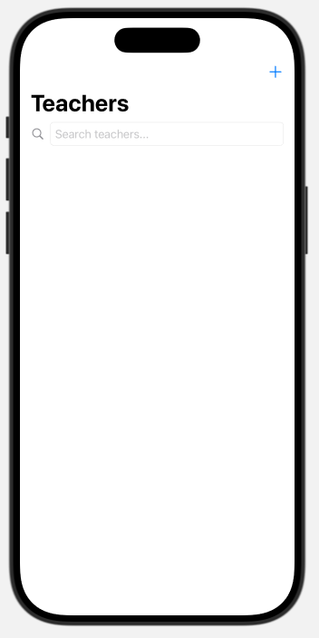
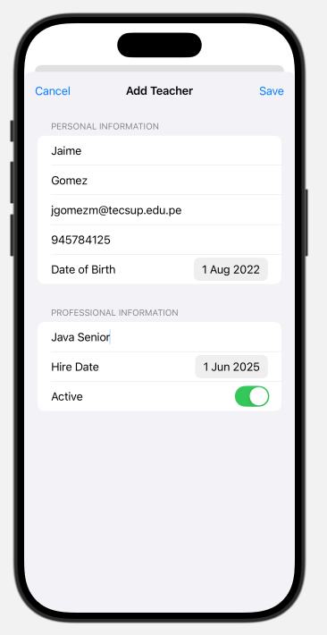
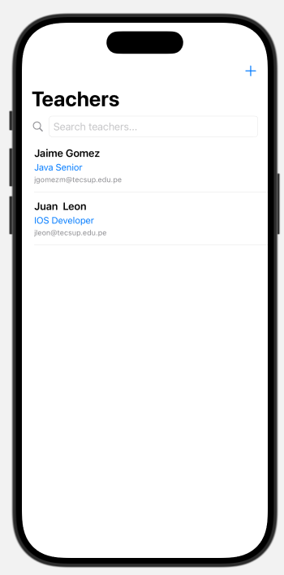
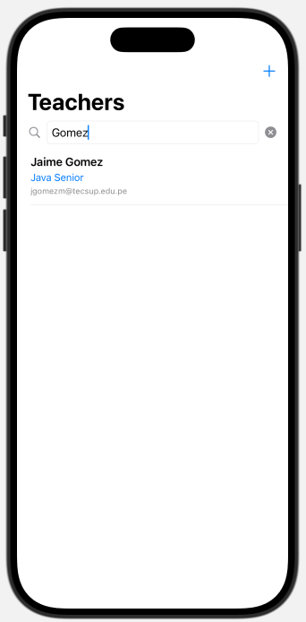
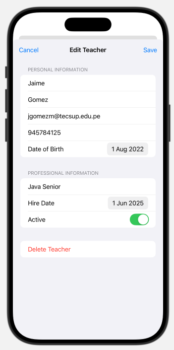
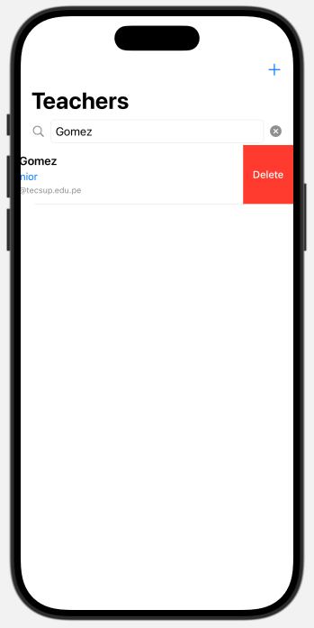

### Laboratorio Calificado 3 : CRUD Docente con SwiftData

### Implementar

#### 1.- Página principal y creación de docente

  
  

#### 2.- Lista y buscar de docentes

  
  

#### 2.- Edición y borrado de docente

  
  

